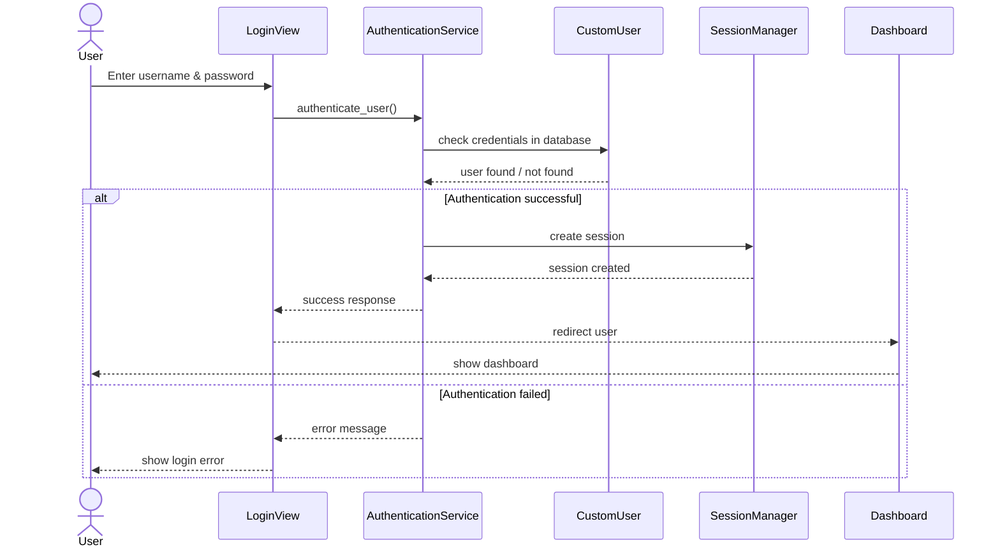

```mermaid
sequenceDiagram

    actor User

    participant LoginView
    participant AuthenticationService
    participant CustomUser
    participant SessionManager
    participant Dashboard

    User->>LoginView: Enter username & password
    LoginView->>AuthenticationService: authenticate_user()

    AuthenticationService->>CustomUser: check credentials in database
    CustomUser-->>AuthenticationService: user found / not found

    alt Authentication successful
        AuthenticationService->>SessionManager: create session
        SessionManager-->>AuthenticationService: session created

        AuthenticationService-->>LoginView: success response
        LoginView-->>Dashboard: redirect user
        Dashboard-->>User: show dashboard
    else Authentication failed
        AuthenticationService-->>LoginView: error message
        LoginView-->>User: show login error
    end
```