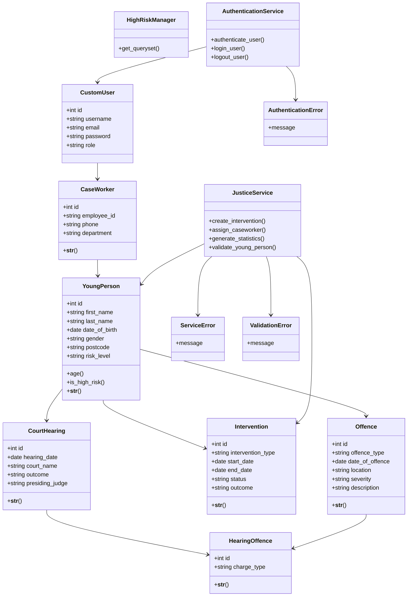

# Relationship

CustomUser → CaseWorker  
- One CustomUser has one CaseWorker profile (One-to-One)

CaseWorker → YoungPerson  
- One CaseWorker manages many YoungPersons (One-to-Many)

YoungPerson → Offence  
- One YoungPerson can commit many Offences (One-to-Many)

YoungPerson → Intervention  
- One YoungPerson can receive many Interventions (One-to-Many)

YoungPerson → CourtHearing  
- One YoungPerson can attend many CourtHearings (One-to-Many)

CourtHearing ↔ Offence (via HearingOffence)  
- Many-to-Many relationship through HearingOffence junction table

Views → Services → Models  
- Views interact with the service layer which handles business logic and database operations

Services → Exceptions  
- Services raise custom exceptions for validation and error handling

# Diagram

