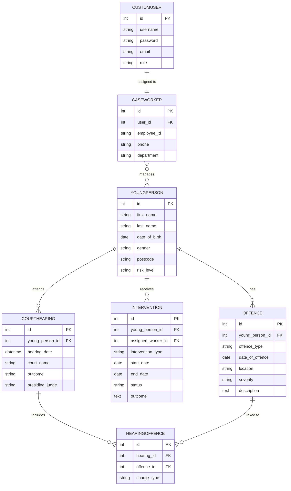

## Entity Relationship Diagram
## Youth Justice & Crime App — Group 7

This diagram shows the updated database structure
for Assessment 4 including authentication support
through the CustomUser model.

## Relationships

- CustomUser → CaseWorker (one to one)
- CaseWorker ↔ YoungPerson (many to many)
- YoungPerson → Offence (one to many)
- YoungPerson → Intervention (one to many)
- YoungPerson → CourtHearing (one to many)
- CourtHearing ↔ Offence through HearingOffence

## Diagram

