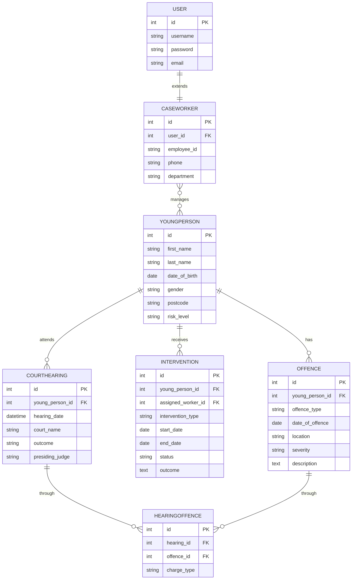

# Entity Relationship Diagram
## Youth Justice & Crime App — Group 7

This diagram shows all models in the application and
how they relate to each other.

## Relationships

- User → CaseWorker (one to one)
- CaseWorker ↔ YoungPerson (many to many)
- YoungPerson → Offence (one to many)
- YoungPerson → Intervention (one to many)
- YoungPerson → CourtHearing (one to many)
- CourtHearing ↔ Offence through HearingOffence (through model)

## Diagram

